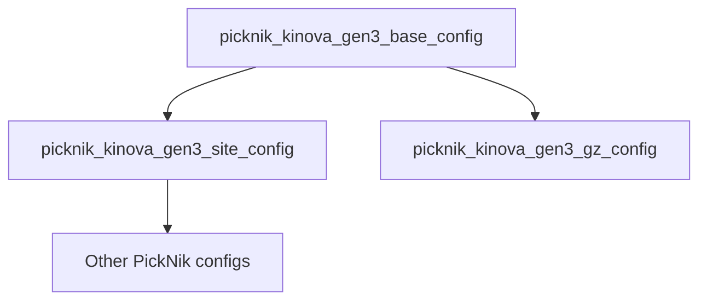

# MoveIt Studio Kortex Workspace

This is a sample user workspace for running MoveIt Studio with Kinova's family of arms.
For more information, refer to the [MoveIt Studio Documentation](https://docs.picknik.ai/).

Instructions for building your own MoveIt Studio configuration can be found [here.](https://docs.picknik.ai/en/stable/getting_started/configuration_tutorials/configure_custom_robot/config_package.html)

MoveIt Studio can be used with real robots and full simulators such as Gazebo and NVIDIA Isaac Sim.
For testing purposes, you can also use the [ROS 2 Control Mock Components](https://control.ros.org/master/doc/ros2_control/hardware_interface/doc/mock_components_userdoc.html), which is what this repo is configured to use.

---
## MoveIt Studio Configuration

This package follows the recommended layout of a MoveIt Studio configuration package.
Any configuration package or custom Behavior implementation can be included in the `src/` directory.
Packages in `src/` will be compiled and sourced by MoveIt Studio at first launch.

## Kinova Configuration Packages

This workspace contains several MoveIt Studio configuration packages for Kinova arms that inherit from each other for different applications.

