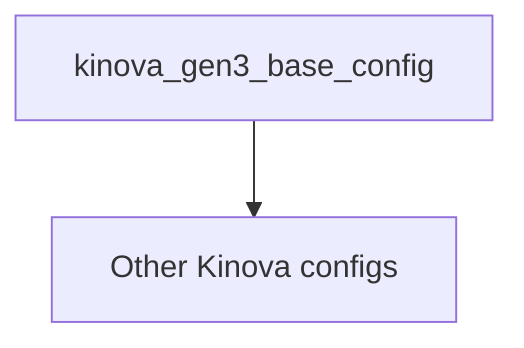

# MoveIt Pro Kortex Workspace

This is a sample user workspace for running MoveIt Pro with Kinova's family of arms.
For more information, refer to the [MoveIt Pro Documentation](https://docs.picknik.ai/).

Instructions for building your own MoveIt Pro configuration can be found [here.](https://docs.picknik.ai/docs/getting_started/configuration_tutorials/configure_custom_robot/)

MoveIt Pro can be used with real robots and full simulators such as Gazebo and NVIDIA Isaac Sim.
For testing purposes, you can also use the [ROS 2 Control Mock Components](https://control.ros.org/master/doc/ros2_control/hardware_interface/doc/mock_components_userdoc.html), which is what this repo is configured to use.

---
## MoveIt Pro Configuration

This package follows the recommended layout of a MoveIt Pro configuration package.
Any configuration package or custom Behavior implementation can be included in the `src/` directory.
Packages in `src/` will be compiled and sourced by MoveIt Pro at first launch.

## Kinova Configuration Packages

This workspace contains a base MoveIt Pro configuration package for Kinova arms that other Kinova configuration packages may inherit from.

